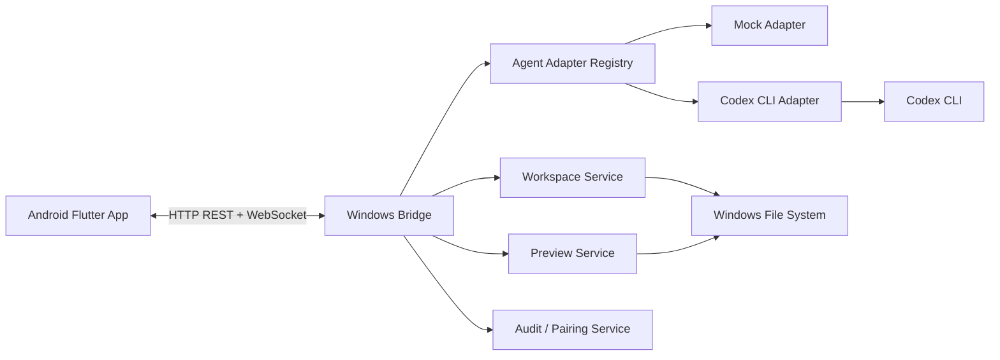

# AgentLink 产品与开发规格 v0.1

## 1. 产品定义

AgentLink 是一个手机端统一控制台，用 Android App 操作同一局域网内 Windows 电脑上的本地 AI Agent。首发版本聚焦 Codex，后续通过 Adapter 扩展 Cursor、Trae、Claude Code、WorkBuddy 等主流 Agent。

核心差异点：

- 一个 App 互联多个电脑端 Agent。
- 可切换设备、工作区、Agent 和操控模式。
- 手机端显示结构化任务流，而不是完整远程桌面。
- 支持项目结构、任务日志、HTML 预览、Markdown 预览、Word/PDF 预览等移动端友好的查看方式。

## 2. 首发约束

| 项目 | 决策 |
| --- | --- |
| 手机端 | Android |
| 电脑端 | Windows |
| 首发 Agent | Codex |
| 网络 | 局域网 |
| Android 技术栈 | Flutter |
| Windows Bridge | Node.js + TypeScript + Fastify |
| 实时通信 | WebSocket |
| 包管理 | pnpm |

## 3. 功能清单

### P0：首发必须

| 模块 | 功能 | 当前状态 |
| --- | --- | --- |
| 设备 | 手动配置 Bridge 地址、设备状态展示 | 原型完成，真实配对待实现 |
| 工作区 | 工作区列表、目录树、文件搜索 | Bridge + App 初步接通 |
| Agent | Codex / Mock Adapter 切换 | Bridge 已支持 adapter registry |
| 任务 | 创建、运行、取消、状态流转 | Bridge + App 初步接通 |
| 实时事件 | WebSocket 输出、状态、产物事件 | 已实现 |
| 预览 | HTML preview endpoint | Bridge 已实现 mock HTML 预览 |
| 离线体验 | Bridge 不可用时本地 mock fallback | App 已实现 |
| Android 工程 | 可构建 debug APK | 已实现 |

### P1：下一阶段增强

- 局域网二维码配对、短期 token、设备撤销。
- 文件内容读取、Markdown 原生渲染、图片/PDF 预览。
- Codex 真实会话恢复、历史任务分页、事件序号补偿。
- 任务模板：修复 bug、解释代码、运行测试、生成文档。
- Bridge 托盘程序或 Windows 后台服务。
- 操作审计日志和危险操作二次确认。

### P2：多 Agent 扩展

- Cursor / Trae / Claude Code / WorkBuddy Adapter。
- 多 Agent 并发任务队列。
- 同一工作区跨 Agent 时间线。
- 远程访问中继、离线任务和断线恢复。

## 4. 系统架构



## 5. UI 原型

### 底部导航

```text
[Tasks]  [Projects]  [Preview]  [Devices]  [Settings]
```

### 任务页

```text
┌────────────────────────────────────┐
│ AgentLink                 Online   │
│ Windows-PC | Bridge connected      │
├────────────────────────────────────┤
│ Codex tasks              1 running │
│ [All] [Queued] [Running] [Done]    │
│                                    │
│ ● Running                          │
│ Build Android Bridge client        │
│ Codex is analyzing the workspace   │
│ task_xxx                         > │
│                                    │
│ ✓ Completed                        │
│ Generate product spec              │
│ Artifact ready: preview.html       │
│ task_yyy                         > │
├────────────────────────────────────┤
│ Describe a task for Codex...   ↑   │
└────────────────────────────────────┘
```

### 项目页

```text
┌────────────────────────────────────┐
│ Projects                  Online   │
│ Local demo workspace               │
├────────────────────────────────────┤
│ Search files...                    │
│                                    │
│ ▾ src                              │
│   app.ts                           │
│ README.md                          │
│ package.json                       │
└────────────────────────────────────┘
```

### 预览页

```text
┌────────────────────────────────────┐
│ Preview                            │
├────────────────────────────────────┤
│ preview.html                       │
│ Source: task_xxx                   │
│ [Refresh] [Open in browser]        │
│                                    │
│ HTML / Markdown / PDF viewport     │
└────────────────────────────────────┘
```

## 6. Bridge API 草案

| 方法 | 路径 | 用途 |
| --- | --- | --- |
| `GET` | `/v1/health` | Bridge 健康检查 |
| `GET` | `/v1/workspaces` | 工作区列表 |
| `GET` | `/v1/workspaces/:id/tree` | 工作区目录树 |
| `GET` | `/v1/sessions` | 会话列表 |
| `POST` | `/v1/sessions` | 创建会话 |
| `GET` | `/v1/tasks` | 任务列表 |
| `POST` | `/v1/tasks` | 创建任务，支持 `agentId` |
| `POST` | `/v1/tasks/:id/cancel` | 取消任务 |
| `GET` | `/v1/artifacts/:taskId/preview.html` | HTML 产物预览 |
| `GET` | `/v1/events` | WebSocket 事件流 |

## 7. Adapter 抽象

```ts
interface AgentAdapter {
  readonly id: string;
  checkAvailability(): Promise<AgentAvailability>;
  run(request: AgentRunRequest): Promise<void>;
  cancel(taskId: string): boolean;
}
```

事件统一归一为：

- `task.status`
- `task.output`
- `task.error`
- `artifact.ready`

## 8. 当前 Definition of Done

- Bridge TypeScript typecheck 通过。
- Bridge REST + WebSocket 测试通过。
- Flutter App 可 analyze、test、debug APK build。
- App 离线时保留 mock 数据，Bridge 在线时走真实 REST / WebSocket。
- BAT 脚本保持 ASCII 文案，避免 Windows 编码乱码。
