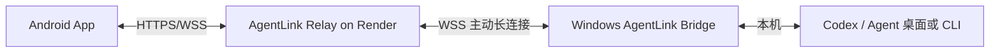

# AgentLink 云中继 MVP

目标：手机不在局域网时，也能通过公网 Relay 操作家里/公司电脑上的 AgentLink Bridge。

## 架构



- 手机端仍按原来的 Bridge API 调用 `/v1/workspaces`、`/v1/tasks`、`/v1/events`。
- Relay 收到手机 HTTP 请求后，通过 WebSocket RPC 转给电脑端 Bridge。
- Bridge 在电脑端本机执行原有 API，再把响应回传给 Relay。
- Bridge 的本机事件流 `/v1/events` 会转发到 Relay，再广播给手机。

## Render 部署

1. 把仓库推到 GitHub / GitLab。
2. Render 新建 Blueprint，选择本仓库的 `render.yaml`。
3. 部署完成后设置：
   - `AGENTLINK_PUBLIC_URL=https://你的服务名.onrender.com`
   - `AGENTLINK_RELAY_SECRET=一串随机密钥`
   - `AGENTLINK_RELAY_DEVICE_ID=pc-main`
4. 打开 `https://你的服务名.onrender.com/pair`，扫码导入手机 App。

## 电脑端 Bridge 启动

PowerShell 示例：

```powershell
$env:AGENTLINK_RELAY_URL="https://你的服务名.onrender.com"
$env:AGENTLINK_RELAY_SECRET="和 Render 一样的密钥"
$env:AGENTLINK_RELAY_DEVICE_ID="pc-main"
pnpm --filter agent-link-bridge start
```

启动后终端会显示：

```text
AgentLink Relay connected: https://你的服务名.onrender.com as pc-main
```

## 手机端使用

- 设置页的 `Bridge / Relay 地址` 填 Render URL。
- `访问令牌` 填 `AGENTLINK_RELAY_SECRET`。
- 也可以打开 Relay `/pair` 页面扫码；二维码会携带 URL 和访问令牌。

## MVP 限制

- Relay 当前是单电脑/单设备优先设计。
- Relay 只转发 JSON API 和事件流；大文件/二进制预览后续再加分片。
- Render 免费实例可能冷启动，首次连接会慢几秒。
